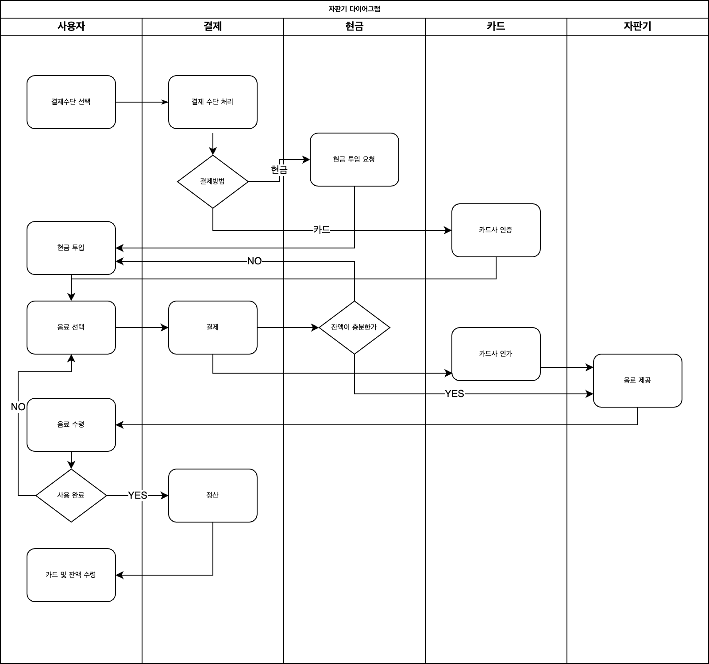

# 다이어그램



# 프로젝트 구성

React + TypeScript + Vite 으로 아래의 스캐폴딩 템플릿을 이용해 프로젝트를 생성하였습니다.

```bash
pnpm create vite vending-machine-jinseog --template react-ts
```

## 폴더 구조

```bash
├── src/
│   ├── components/
│   │   └── DrinkPannel.tsx # 구매 가능한 음료 목록
│   │   └── PaymentPannel.tsx # 현금 및 카드 결제수단 선택 및 잔액정산 기능 제공
│   │   └── PaymentSelection.tsx # 현금 입력과 및 카드 상태 표현
│   │   └── UserSection.tsx # 사용자가 구매한 목록 및 초기화 버튼 제공
│   ├── contexts/
│   │   └── VendingMachineContext.tsx # Context api 로 구현한 자판기 상태 구현체
│   ├── lib/
│   │   └── vending-machine-calculator.ts # 자판기에 필요한 계산 메서드 제공
│   ├── types/
│   │   └── model.ts # 자판기 모델에 필요한 타입 정의
│   ├── App.tsx
```

## [VendingMachineContext](./src/contexts/VendingMachineContext.tsx)

자판기 구현에 필요한 상태를 전역에서 참조 및 관리가 가능하도록 Context api 를 사용하여 구현했습니다.

### Why Context API

1. 다이어그램을 작성하며 관리해야할 상태의 높은 복잡도로 전역 상태 관리가 필요하다고 판단되었습니다.
2. Redux 같은 외부 상태 관리 라이브러리와 비교해서 간단하게 구현이 가능합니다.

### 고민 Point

1. Context 가 업데이터될 때마다 모든 컴포넌트가 리렌더되는 이슈가 발생하여 성능에 미치는 영향
   Context 를 분리하여 독립적으로 작동하게 만들면 불필요한 리렌더를 방지할 수 있어보입니다. e.g) PaymentProvider, CashProvider ...
2. 관리해야될 상태가 많아질수록 복잡도 증가
3. 테스트 코드 작성의 어려움. Context Provider 등 모킹이 필요함

처음에는 Context api 를 사용하는게 괜찮은 선택으로 생각했으나 과제를 완성해 나가면서 복잡도가 증가되어 코드가 점점 읽기 어려워졌습니다. Context 를 분리하거나 Redux 같은 강력한 라이브러리를 사용하여 개선할수 있다고 생각됩니다.

### 상태값에 대한 설명

1. `insertedCash` 유저가 투입한 현금
2. `cash` 자판기에서 보관중인 현금
3. `paymentMethod` 유저가 선택한 결제수단
4. `creditCard` 카드의 승인 상태
5. `purchaseDrink` 유저가 구매한 음료 목록

## [vending-machine-calculator](./src/lib/vending-machine-calculator.ts)

자판기의 현금 처리를 구현할 때 처음에는 단순히 잔액만 계산하여 구현하였으나 중간에 욕심이 생겨 실제 자판기의 동작처럼 입력 가능한 현금별로 수량을 상태로 관리하도록 변경하였습니다.
이에 따른 복잡도 증가로 계산 로직을 분리하고, 이에 대한 테스트 케이스를 만들어 리펙터링 내성과 회귀 버그를 예방하는데 도움을 받을 수 있었습니다.

## 발생 가능한 케이스에 대한 고민

1. 음료 구매 버튼의 비활성화 조건
   - 현금의 경우 잔액의 부족
   - 카드 승인 중 혹은 승인 완료 전 (비동기 처리 필요)
2. 잔액이 존재하는데 결제 수단을 카드로 변경 시도
   - 잔액반환 전 결제 수단을 변경하지 못하도록 UX 추가
3. 결제 수단 미선택
   - default 결제 수단을 현금으로 설정하여 해결
4. 투입된 현금의 단위가 다양하고 많을 경우
   - 실제 사용자의 경우 잔돈 보다는 큰 단위의 돈으로 거슬러 받는걸 원함
   - 잔돈 계산시 큰 단위의 현금을 우선적으로 반환할 수 있도록 계산 로직 설계
5. 음료의 가격이 100원 단위가 아닐 경우
   - 잔돈 계산시 오류가 발생. 현금 단위를 늘리거나 100원 단위가 아닌 음료의 등록을 막아야 됨

# 프로젝트 실행

install

```bash
pnpm install
```

run

```bash
pnpm dev
```

test

```bash
pnpm test
```
